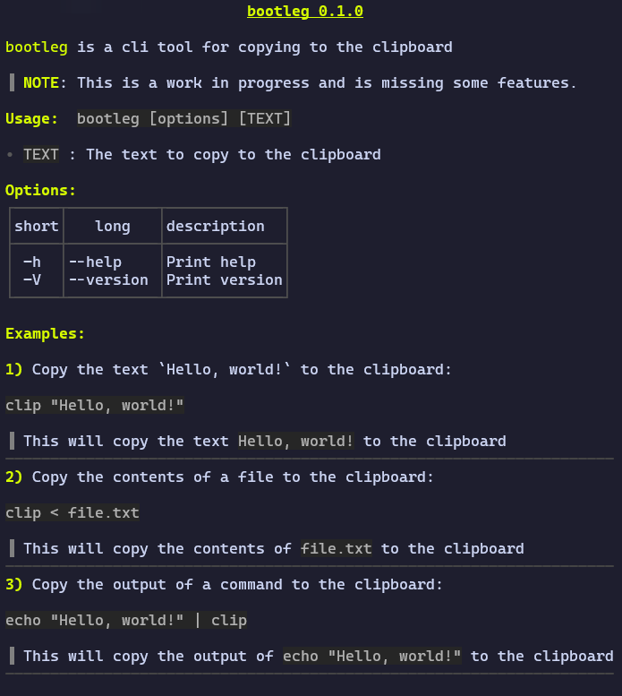

<div align="center">
  
  
  <!-- MIT License -->
  <a href="https://github.com/hadronomy/bootleg/blob/main/LICENSE.txt">
    
  </a>

  <!-- GitHub Repo Stars -->
  <a href="https://github.com/hadronomy/bootleg/stargazers">
    
  </a>
  <p></p>
  <span>
    A simple cli tool to copy everything directly from the terminal.
  </span>
  <p></p>
  <a href="#docs">Docs</a> •
  <a href="#build">Installation</a> •
  <a href="#usage">Usage</a> •
  <a href="#license">License</a>
  <hr />

</div>




</div>

## Installation

```bash
cargo install bootleg --locked
```

## Usage

Copy written text to the clipboard.

```bash
bootleg "Hello, World!"
```

Copy output of a command to the clipboard.

```bash
echo "Hello, World!" | bootleg
```

Copy the content of a file to the clipboard.

```bash
cat file.txt | bootleg
```

## License

This project is licensed under the MIT License - see the [LICENSE](LICENSE) for details.
